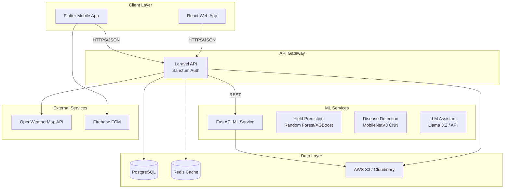
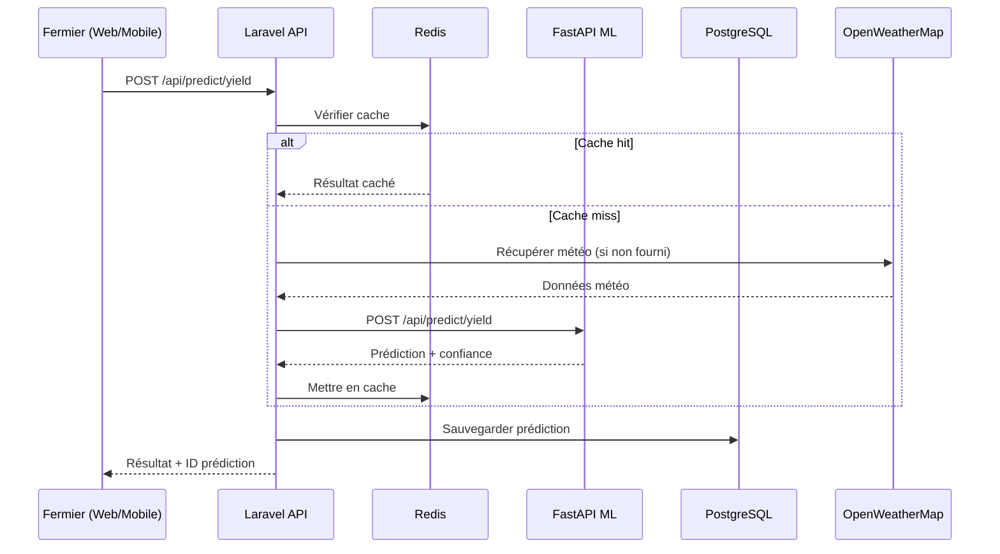
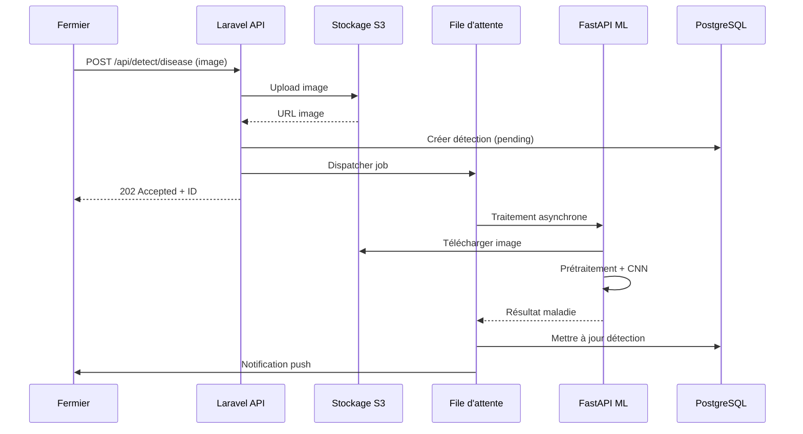

# Architecture Sentinelle Agricole

## Vue d'ensemble

## Flux de données

### 1. Prédiction des Récoltes

### 2. Détection Maladies

## Stack Technique

| Couche | Technologie |
|--------|-------------|
| Frontend Web | React 19 + Vite + Tailwind CSS + Recharts + Leaflet |
| Mobile | Flutter 3 + Material You + Firebase |
| Backend API | Laravel 12 + Sanctum + PostgreSQL + Redis |
| ML Service | Python 3.12 + FastAPI + scikit-learn + TensorFlow |
| DevOps | Docker + Docker Compose |
| Stockage | AWS S3 / Cloudinary |
| Météo | OpenWeatherMap API |
| Notifications | Firebase Cloud Messaging |

## Sécurité

- Authentification JWT via Laravel Sanctum
- Rate limiting sur toutes les routes API
- Validation stricte des entrées (Form Requests)
- CORS configuré par environnement
- Upload d'images limité (10MB, types vérifiés)
- Chiffrement des données sensibles
